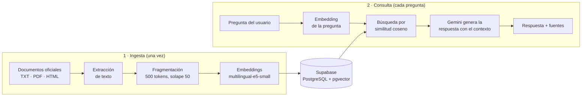

# TramitesIA

Asistente que responde preguntas sobre trámites del Estado peruano (SUNAT, RENIEC, SUNARP y municipalidades) usando **RAG** (*Retrieval-Augmented Generation*).

El ciudadano pregunta en lenguaje natural —por ejemplo, *"¿Qué necesito para sacar mi RUC?"*— y recibe una respuesta clara, en español sencillo, junto con los **enlaces a las fuentes oficiales** de donde salió la información.

> **Estado:** Fase 1 (backend) terminada ✅ · Fase 2 (app móvil en Flutter) en desarrollo 🚧

---

## Índice

- [¿Por qué RAG?](#por-qué-rag)
- [Arquitectura](#arquitectura)
- [Tecnologías](#tecnologías)
- [Estructura del proyecto](#estructura-del-proyecto)
- [Instalación](#instalación)
- [Ingesta de documentos](#ingesta-de-documentos)
- [Levantar el servidor](#levantar-el-servidor)
- [Uso de la API](#uso-de-la-api)

---

## ¿Por qué RAG?

Un modelo de lenguaje por sí solo puede **inventar** requisitos, costos o plazos que no existen, algo inaceptable cuando se trata de trámites. Con RAG, el modelo no responde de memoria: primero se **buscan** los fragmentos relevantes de documentos oficiales y luego se le pide que responda **únicamente** con esa información. Si los documentos no contienen la respuesta, el asistente lo dice en lugar de suponer.

## Arquitectura

El sistema tiene dos flujos: la **ingesta**, que se ejecuta una vez para preparar la base de conocimiento, y la **consulta**, que ocurre en cada pregunta.



### 1. Ingesta

| Paso | Qué hace | Archivo |
|------|----------|---------|
| Extracción | Obtiene el texto limpio de archivos TXT, PDF o HTML (quita menús, scripts y pies de página). | [extraccion.py](backend/ingest/extraccion.py) |
| Fragmentación | Divide el texto en fragmentos de **500 tokens** con **50 de solapamiento**, para que una idea que cae en el borde no se pierda. Los tokens se cuentan con el tokenizador del propio modelo de embeddings, que admite un máximo de 512. | [fragmentacion.py](backend/ingest/fragmentacion.py) |
| Embeddings | Convierte cada fragmento en un vector de **384 dimensiones** que representa su significado. | [embeddings.py](backend/rag/embeddings.py) |
| Almacenamiento | Guarda cada fragmento con su vector y sus metadatos (entidad, trámite, URL) en Supabase. | [ingestar.py](backend/ingest/ingestar.py) |

### 2. Consulta

1. **Embedding de la pregunta:** la pregunta se convierte en un vector con el mismo modelo usado en la ingesta.
2. **Búsqueda vectorial:** una función SQL en Supabase (pgvector) devuelve los **5 fragmentos** más parecidos por similitud coseno ([busqueda.py](backend/rag/busqueda.py)).
3. **Generación:** los fragmentos y la pregunta se envían a **Gemini** con instrucciones estrictas ([prompts.py](backend/rag/prompts.py)): usar solo el contexto, no inventar datos y escribir en lenguaje sencillo ([generacion.py](backend/rag/generacion.py)).
4. **Respuesta:** la API devuelve el texto generado y la lista de fuentes oficiales, sin duplicados ([routes.py](backend/app/routes.py)).

### Decisiones de diseño

- **Prefijos de E5 (`query:` / `passage:`).** El modelo fue entrenado así; omitirlos reduce la calidad de la búsqueda.
- **Embeddings locales.** El modelo corre en la propia máquina: no tiene costo por uso y los documentos no se envían a un servicio externo para vectorizarlos.
- **Temperatura baja (0.2).** Se buscan respuestas fieles al texto, no creativas.
- **Respuesta fija sin información.** Si no hay contexto relevante, el modelo responde *"No tengo información sobre eso."* y la API no devuelve fuentes que no se usaron.
- **Protección contra *prompt injection*.** El contenido de los documentos se marca como información, no como instrucciones.
- **Tolerancia a fallos.** Ante saturación de Gemini (errores 429/5xx) se reintenta con espera exponencial y luego se usa un modelo de respaldo; si todo falla, la API responde `503` con la cabecera `Retry-After`.
- **Ingesta idempotente.** Antes de insertar un documento se borran sus fragmentos anteriores, así volver a ejecutarla no duplica datos.

## Tecnologías

| Componente | Tecnología |
|------------|------------|
| Lenguaje | Python 3.13 |
| API web | FastAPI + Uvicorn |
| Configuración | pydantic-settings (variables de entorno / `.env`) |
| Base de datos vectorial | Supabase (PostgreSQL + extensión **pgvector**) |
| Embeddings | [`intfloat/multilingual-e5-small`](https://huggingface.co/intfloat/multilingual-e5-small) vía sentence-transformers |
| LLM | Google Gemini (SDK `google-genai`) |
| Extracción de texto | pypdf (PDF), BeautifulSoup (HTML) |
| App móvil *(fase 2)* | Flutter |

## Estructura del proyecto

```
tramites_IA/
├── backend/
│   ├── app/                 # API FastAPI
│   │   ├── main.py          # punto de entrada y carga inicial del modelo
│   │   ├── routes.py        # endpoints /salud y /preguntar
│   │   ├── schemas.py       # modelos de entrada y salida
│   │   ├── config.py        # configuración desde .env
│   │   └── db.py            # cliente de Supabase
│   ├── ingest/              # pipeline de ingesta
│   │   ├── extraccion.py
│   │   ├── fragmentacion.py
│   │   └── ingestar.py      # script principal
│   ├── rag/                 # lógica RAG
│   │   ├── embeddings.py
│   │   ├── busqueda.py
│   │   ├── generacion.py
│   │   └── prompts.py
│   ├── data/raw/            # documentos fuente + metadatos .json
│   ├── requirements.txt
│   └── .env.example
└── mobile/                  # app Flutter (fase 2)
```

## Instalación

### Requisitos previos

- Python 3.11 o superior (desarrollado con 3.13)
- Una cuenta gratuita de [Supabase](https://supabase.com)
- Una clave de la API de Gemini ([Google AI Studio](https://aistudio.google.com/apikey))

### 1. Clonar el repositorio

```bash
git clone <url-del-repositorio>
cd tramites_IA/backend
```

### 2. Crear y activar el entorno virtual

```powershell
python -m venv venv

# Windows (PowerShell)
.\venv\Scripts\Activate.ps1

# Linux / macOS
source venv/bin/activate
```

> Si PowerShell bloquea la activación, ejecuta una vez:
> `Set-ExecutionPolicy -Scope CurrentUser RemoteSigned`

### 3. Instalar las dependencias

```bash
pip install -r requirements.txt
```

La primera vez que se use el modelo de embeddings (~470 MB) se descargará automáticamente desde Hugging Face.

### 4. Preparar la base de datos en Supabase

En el panel de Supabase, abre **SQL Editor** y ejecuta el contenido de [`backend/sql/esquema.sql`](backend/sql/esquema.sql). Crea la extensión pgvector, la tabla `fragmentos` y la función de búsqueda `buscar_fragmentos`.

> Si tu base ya existía de una versión anterior, ejecuta en su lugar las migraciones numeradas de `backend/sql/` (por ejemplo, `001_fecha_extraccion.sql`) y vuelve a ingestar.

### 5. Configurar las variables de entorno

Copia la plantilla y completa los valores reales:

```powershell
# Windows
copy .env.example .env

# Linux / macOS
cp .env.example .env
```

| Variable | Descripción |
|----------|-------------|
| `SUPABASE_URL` | URL del proyecto (Settings → API → Project URL) |
| `SUPABASE_SERVICE_KEY` | Clave `service_role` (Settings → API). Omite RLS: **úsala solo en el backend** |
| `GEMINI_API_KEY` | Clave de la API de Gemini |
| `GEMINI_MODELO` | *(Opcional)* Modelo principal. Por defecto `gemini-3.8-flash` |
| `GEMINI_MODELO_RESPALDO` | *(Opcional)* Modelo usado si el principal está saturado. Por defecto `gemini-3.5-flash-lite` |

> ⚠️ El archivo `.env` contiene secretos y está excluido de Git mediante `.gitignore`. Nunca lo subas al repositorio.

## Ingesta de documentos

Los documentos van en `backend/data/raw/`. Cada documento (`.txt`, `.pdf`, `.html`) debe tener al lado un archivo `.json` **con el mismo nombre** que contenga sus metadatos:

```
data/raw/
├── sunat_inscripcion_ruc.txt
└── sunat_inscripcion_ruc.json
```

```json
{
  "entidad": "SUNAT",
  "tramite": "Inscripción en el RUC",
  "url_fuente": "https://www.gob.pe/284-inscripcion-en-el-ruc",
  "fecha_extraccion": "2026-10-02"
}
```

`fecha_extraccion` es el día en que se copió el texto de la página oficial (formato `AAAA-MM-DD`); la app la muestra junto a cada fuente.

Desde la carpeta `backend/`, con el entorno virtual activado:

```bash
# Prueba: procesa los documentos sin escribir en la base de datos (no requiere .env)
python -m ingest.ingestar --dry-run

# Ingesta real en Supabase
python -m ingest.ingestar
```

Salida esperada:

```
Procesando 11 documento(s)...

  OK     Acceder al Nuevo RUS.txt: 1 fragmento(s)
  OK     Cerrar una empresa o negocio.txt: 1 fragmento(s)
  ...
  OK     sunat_inscripcion_ruc.txt: 3 fragmento(s)
  OK     Suspensión de retenciones y pagos.txt: 1 fragmento(s)

Listo: 16 fragmento(s) de 11 documento(s), 0 con error.
```

Si un documento tiene problemas (por ejemplo, le falta su `.json`), se informa el error y se continúa con los demás.

## Levantar el servidor

Desde `backend/`, con el entorno virtual activado:

```bash
uvicorn app.main:app --reload
```

Al arrancar, el servidor valida la configuración y carga el modelo de embeddings, de modo que un error de configuración aparece de inmediato y la primera pregunta no tiene que esperar.

| Recurso | URL |
|---------|-----|
| API | http://127.0.0.1:8000 |
| Documentación interactiva (Swagger) | http://127.0.0.1:8000/docs |
| Comprobación de estado | http://127.0.0.1:8000/salud |

## Uso de la API

### `GET /salud`

Comprueba que el servidor está activo.

```json
{ "estado": "ok" }
```

### `POST /preguntar`

Recibe una pregunta (entre 3 y 1000 caracteres) y devuelve la respuesta con sus fuentes.

**Petición**

```bash
curl -X POST http://127.0.0.1:8000/preguntar \
  -H "Content-Type: application/json" \
  -d '{"pregunta": "¿Qué necesito para sacar mi RUC como persona natural?"}'
```

**Respuesta** (`200 OK`, texto abreviado)

```json
{
  "respuesta": "Para inscribirte en el RUC como persona natural, los requisitos varían según la forma en que decidas hacerlo:\n\n**Si lo haces por Sunat Virtual o la App Personas:**\n1. Tu DNI, número de celular y correo electrónico.\n2. La fecha de inicio de tus actividades económicas...\n3. Indicar tu domicilio fiscal...\n4. Indicar tu actividad económica principal basada en la lista CIIU.\n...\n\n**Si lo haces de modo presencial:**\n1. Documento de identidad (DNI, Carnet de Extranjería, ...).\n...\n5. El Formulario 2119 completo.\n...",
  "fuentes": [
    {
      "tramite": "Inscripción en el RUC",
      "url": "https://www.gob.pe/284-inscripcion-en-el-ruc",
      "fecha_extraccion": "2026-10-02"
    },
    {
      "tramite": "Acceder al Nuevo RUS",
      "url": "https://www.gob.pe/1212-acceder-al-nuevo-rus",
      "fecha_extraccion": "2026-10-02"
    }
  ]
}
```

Si la pregunta no está cubierta por los documentos:

```json
{
  "respuesta": "No tengo información sobre eso.",
  "fuentes": []
}
```

**Códigos de estado**

| Código | Significado |
|--------|-------------|
| `200` | Respuesta generada correctamente |
| `422` | Pregunta inválida (vacía, muy corta o más de 1000 caracteres) |
| `502` | Error inesperado al buscar o generar la respuesta |
| `503` | El modelo de IA está saturado; reintentar tras los segundos indicados en `Retry-After` |

---

## Autor

Proyecto de portafolio desarrollado por **Grimaldo Arredondo Martínez** — estudiante de Ingeniería de Sistemas.
